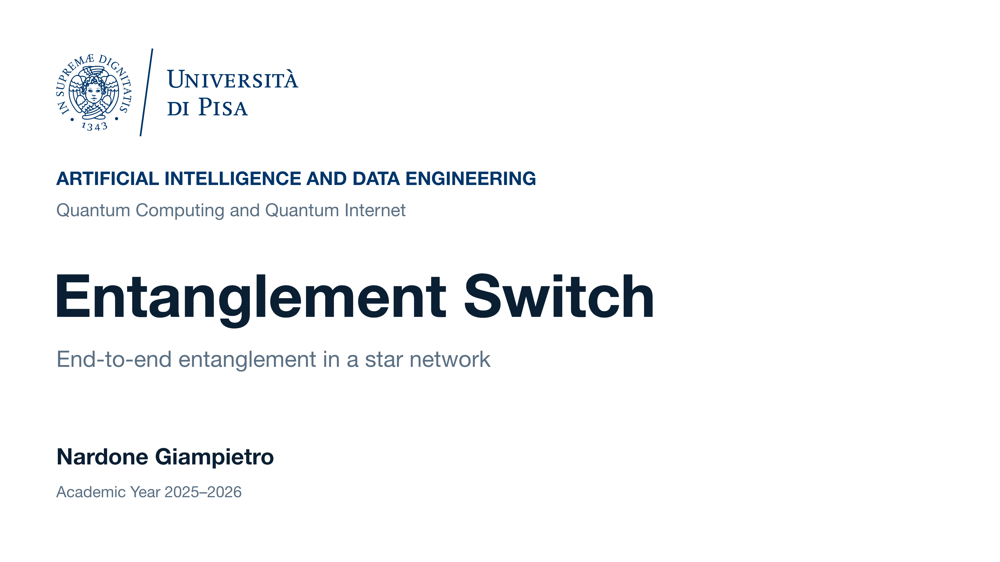

# Entanglement Switch



## Project Overview

This project studies an entanglement switch in a star-shaped quantum network. A central switch creates entanglement between clients by selecting the two oldest available link-level pairs and performing entanglement swapping. The simulations compare an ideal model with a nonideal model that includes probabilistic link generation, imperfect Werner states and memory depolarization. Performance is evaluated through throughput, mean fidelity and waiting time.

The code is written in Julia and uses [QuantumSavory](https://github.com/QuantumSavory/QuantumSavory.jl), a simulator of quantum hardware and networks with discrete-event simulation capabilities.

## Project Structure

```text
.
├── Project.toml                  # Julia dependencies
├── Manifest.toml                 # Pinned package versions
├── entanglement_switch/
│   ├── IdealEntanglementSwitch.jl
│   ├── NonIdealEntanglementSwitch.jl
│   ├── ideal_benchmark_analysis.jl
│   └── nonideal_benchmark_analysis.jl
├── results/
│   ├── ideal_switch/             # Two ideal-model plots
│   └── nonideal_switch/          # Four nonideal-model plots
├── docs/
│   └── Assignment 10.pdf         # Project assignment
├── presentation/
│   ├── entanglement_switch_cover.png
│   ├── entanglement_switch_presentation.pptx
│   └── entanglement_switch_presentation.pdf
└── README.md
```

- **`IdealEntanglementSwitch.jl`** implements the ideal network, link generation, oldest-first switching policy and collection of delivery times, fidelities and waiting times.
- **`NonIdealEntanglementSwitch.jl`** extends the shared switching logic with probabilistic link generation, Werner states and memory depolarization.
- **`ideal_benchmark_analysis.jl`** runs the ideal benchmark, checks the theoretical throughput and fidelity, and plots both metrics against the number of clients.
- **`nonideal_benchmark_analysis.jl`** runs four parameter sweeps: fidelity versus the Werner parameter, throughput versus link success probability, fidelity versus link success probability, and waiting time versus the number of clients. It also checks the Werner-state swapping formula and prints an analysis of the results.

## How to Run the Benchmarks

Install Julia **1.12.7**, the version used by the project. From the repository root, install the dependencies:

```sh
julia --startup-file=no --project=. -e 'using Pkg; Pkg.instantiate()'
```

Run the ideal benchmark:

```sh
julia --startup-file=no --project=. entanglement_switch/ideal_benchmark_analysis.jl
```

Run the nonideal benchmark:

```sh
julia --startup-file=no --project=. entanglement_switch/nonideal_benchmark_analysis.jl
```

The scripts run the simulations, print results in the terminal and save two PNG plots in `results/ideal_switch/` and four PNG plots in `results/nonideal_switch/`. Existing plots with the same names are overwritten.

## Presentation

See the [presentation in PDF format](presentation/entanglement_switch_presentation.pdf) for the full model description, theoretical derivations and analysis of the simulation results.
