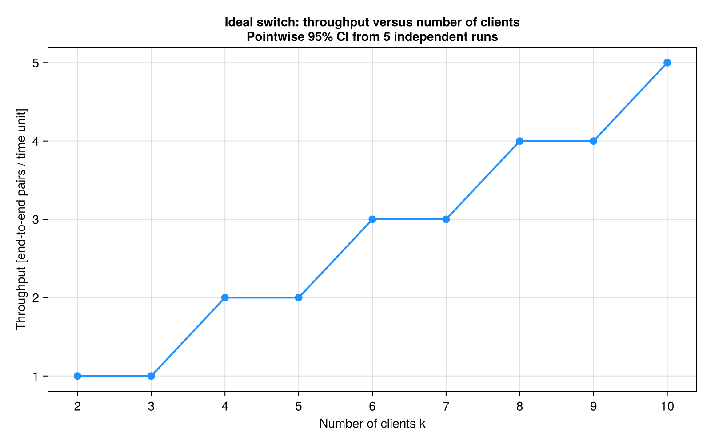
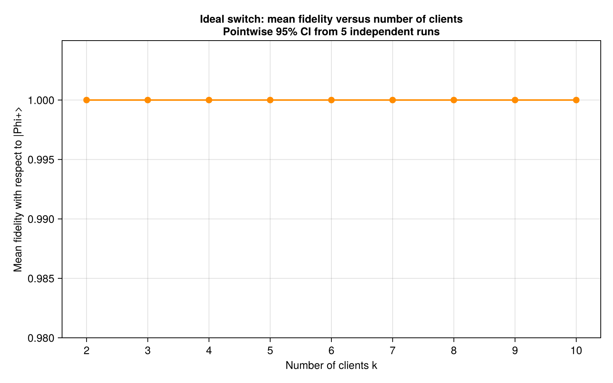
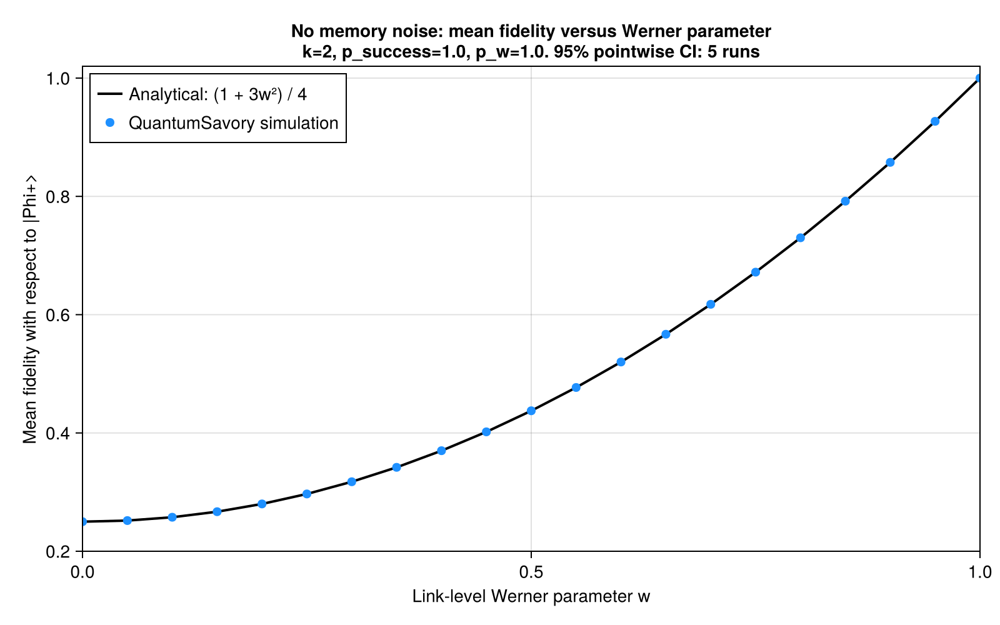
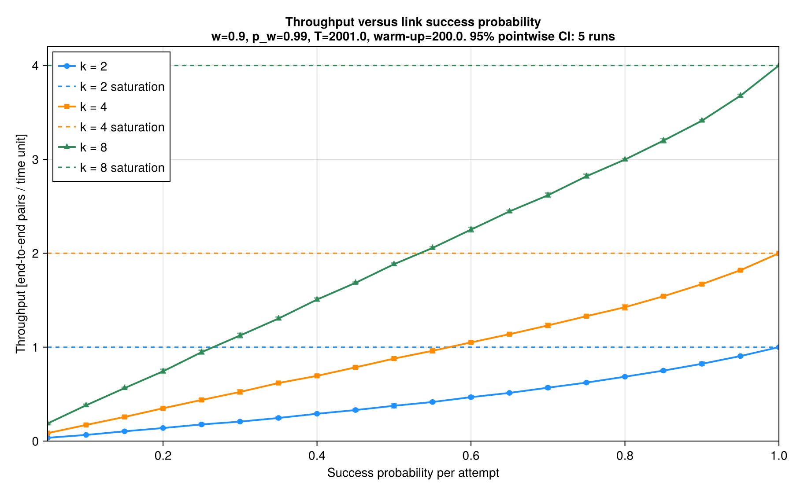
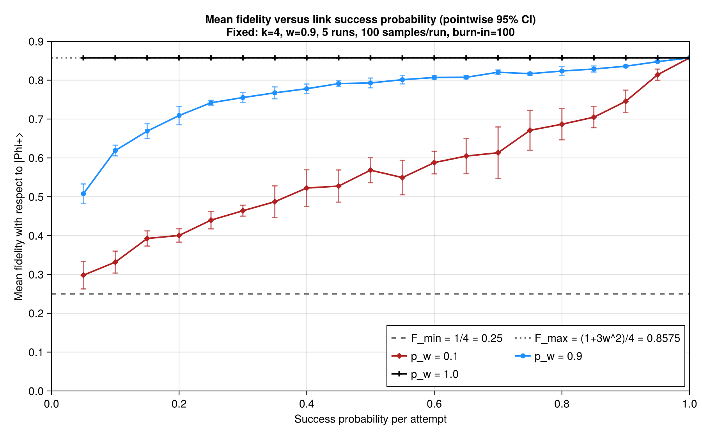
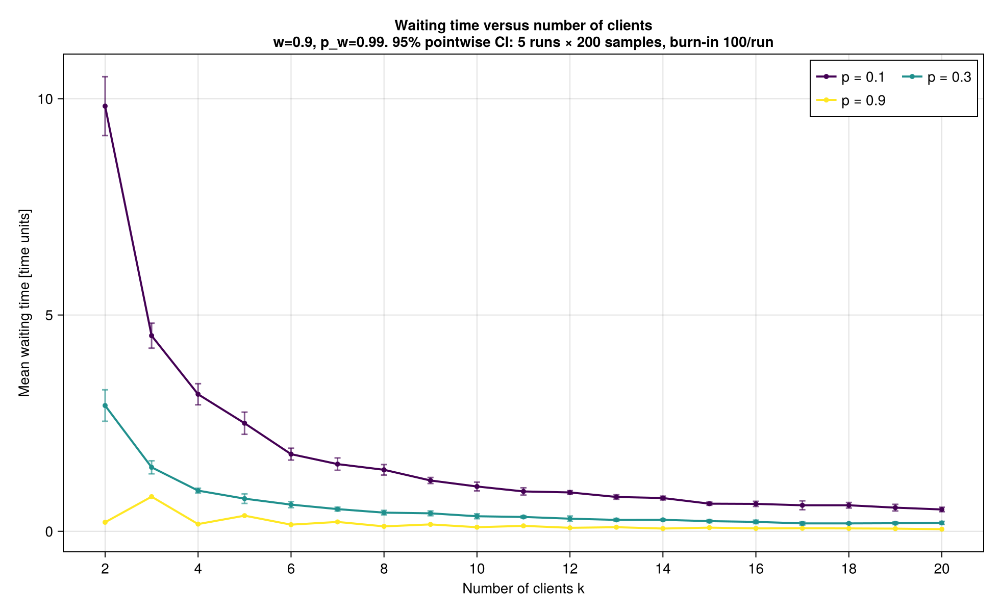

# Entanglement Switch


## Introduction

This project, developed for the **Quantum Computing and Quantum Information (QCQI)** exam, studies an **entanglement switch** in a star-shaped quantum network. A central switch distributes entanglement between clients by combining pairs generated on separate links through entanglement swapping.

The simulations compare ideal operation with a nonideal model that includes probabilistic link generation, imperfect initial states and memory depolarization. The aim is to understand how these factors affect the rate, quality and waiting time of the delivered pairs. The implementation uses Julia and [QuantumSavory](https://github.com/QuantumSavory/QuantumSavory.jl) for discrete-event simulation of the network.

## Background

### The Problem

Clients connected to a central node initially share link-level pairs with the switch, rather than directly with one another. Establishing a pair between two clients requires two available links. When generation is probabilistic, one pair may have to wait for another, occupying quantum memories and accumulating noise.

### The Switching Approach

The switch selects the **two oldest available link-level pairs** and performs a Bell-state measurement (BSM) on their switch-side qubits. Once the measurement outcomes have been accounted for through Pauli corrections, the remote qubits form an end-to-end pair. The clients immediately consume the delivered pair, freeing their memories for new generation attempts.

## Scenarios Considered

1. **Ideal model:** deterministic generation of perfect Bell pairs, noiseless memories and ideal swapping.
2. **Nonideal model:** probabilistic generation of Werner states and depolarizing memory noise, with the same switching policy and ideal BSM.

The nonideal benchmarks vary link-state quality, generation success probability, memory retention and the number of clients to examine their effects separately.

## Network Model

The network contains one switch and $k$ clients. The switch has **one memory slot per client**, and each client has **one memory slot**. Each generation attempt takes one unit of simulated time and uses the corresponding switch and client slots.

Both scenarios assume instantaneous, successful BSMs, zero classical communication delay and immediate consumption of end-to-end pairs. Any pair of distinct clients can receive a delivery. These assumptions define the scope of the throughput and fidelity results below.

### 1. Ideal Operation

Each available link generates the perfect Bell state

$$
|\Phi^+\rangle = \frac{|00\rangle + |11\rangle}{\sqrt{2}}
$$

with success probability $p_{\mathrm{success}}=1$. Memories introduce no noise, so ideal swapping preserves unit fidelity with respect to $|\Phi^+\rangle$ after the appropriate corrections.

### 2. Nonideal Operation

Each generation attempt succeeds with probability $p_{\mathrm{success}}$. A successful attempt produces the link state

$$
\rho(w) = w|\Phi^+\rangle\langle\Phi^+| + (1-w)\frac{I_4}{4},
\qquad 0 \leq w \leq 1.
$$

Here, $w$ is the **Werner parameter**: $w=1$ gives a perfect Bell pair, while $w=0$ gives the maximally mixed two-qubit state. The corresponding link fidelity is $(1+3w)/4$.

All switch and client memories have the same retention factor $p_w$ per unit of simulated time. The implementation converts it to the characteristic depolarization time

$$
\tau = -\frac{1}{\ln p_w}, \qquad 0 < p_w < 1.
$$

Setting $p_w=1$ disables memory noise. Smaller retention factors cause faster degradation while a pair waits for swapping.

## Protocol Details

The shared switching logic proceeds as follows:

1. Generate link-level pairs whenever the required memories are free.
2. Wait until at least two pairs are available at the switch.
3. Sort available pairs by creation time, using the switch slot index to break ties, and select the oldest two.
4. Perform the BSM and propagate its outcomes to the clients through the entanglement trackers.
5. Record the delivered pair's fidelity and delivery time, consume it, and release the memories.

Without memory degradation, swapping two link states with the same Werner parameter gives the end-to-end fidelity

$$
F_{\mathrm{swap}} = \frac{1+3w^2}{4}.
$$

The nonideal benchmark checks this prediction with two clients, deterministic generation and noiseless memories, isolating the effect of the initial link-state quality.

## Evaluation Metrics

- **Throughput:** number of delivered end-to-end pairs per unit of simulated time. Deliveries in the interval $[t_{\mathrm{warmup}},T)$ are counted and divided by $T-t_{\mathrm{warmup}}$. Every delivered pair is counted, without a fidelity threshold.
- **Mean fidelity:** average overlap $\langle\Phi^+|\rho_{\mathrm{out}}|\Phi^+\rangle$ of delivered pairs with the target Bell state, evaluated after the swapping corrections.
- **Mean waiting time:** average time from the creation of the **older of the two selected link pairs** to completion of the BSM. This excludes generation attempts before that pair exists.

The default benchmarks average five independent runs per parameter point, using reproducible seeds. Error bars represent pointwise 95% Student-t confidence intervals across run means; a curve's bars are omitted when all half-widths are at most 0.5% of the vertical scale used by the plotting code.

## Results

The following figures are included in the repository and can be regenerated with the benchmark scripts.

### 1. Ideal Throughput and Fidelity

For $k=2,\ldots,10$, the ideal benchmark reproduces

$$
R_{\mathrm{ideal}} = \left\lfloor\frac{k}{2}\right\rfloor,
\qquad \overline{F}=1.
$$

The throughput increases in steps: with deterministic generation, each round pairs the available links two at a time. For odd $k$, one link-level pair remains for a later round. The floor formula applies to the generation timing and memory allocation used in this model.



The delivered pairs retain unit fidelity for every tested client count. The script checks both predictions and the vanishing confidence-interval widths.



### 2. Fidelity versus Werner Parameter

With $k=2$ and $p_{\mathrm{success}}=p_w=1$, the benchmark varies $w$ from 0 to 1 in steps of 0.05. The simulated fidelity follows $(1+3w^2)/4$, ranging from $1/4$ for the maximally mixed state to 1 for perfect links. An assertion checks agreement with the analytical curve to an absolute tolerance of $10^{-12}$.



### 3. Throughput versus Generation Success Probability

For $k\in\{2,4,8\}$, $w=0.9$ and $p_w=0.99$, throughput increases with $p_{\mathrm{success}}$. At deterministic generation, the three curves reach 1, 2 and 4 delivered pairs per time unit, respectively. These equal $k/2$ because all client counts in this sweep are even.

Each run lasts 2,001 time units, with the first 200 excluded from the throughput measurement.



### 4. Fidelity versus Generation Success Probability

For $k=4$ and $w=0.9$, the benchmark compares $p_w\in\{0.1,0.9,1.0\}$. Increasing the generation success probability generally improves fidelity because pairs spend less time waiting in noisy memories. All curves reach

$$
F_{\mathrm{swap}} = \frac{1+3(0.9)^2}{4} = 0.8575
$$

at $p_{\mathrm{success}}=1$. With noiseless memories ($p_w=1$), fidelity stays at this value throughout the sweep. Strong memory noise and infrequent successes bring the output closer to the maximally mixed limit of $1/4$.

Each run retains 100 delivered-pair samples after discarding the first 100.



### 5. Waiting Time versus Number of Clients

For $k=2,\ldots,20$, $w=0.9$ and $p_w=0.99$, the benchmark compares $p_{\mathrm{success}}\in\{0.1,0.3,0.9\}$. More clients generally shorten the wait by providing more opportunities to find a second pair; higher generation success probabilities also reduce waiting.

The curves show an odd-even pattern, particularly at high success probability and small client counts: an odd number of available pairs leaves one waiting for a subsequent generation round. Each run retains 200 waiting-time samples after discarding the first 100.



## Conclusion

The ideal simulations establish the expected throughput and unit-fidelity baseline for the implemented switch. The nonideal results show how initial link quality determines the fidelity achievable without memory degradation, while probabilistic generation introduces waiting that allows memory noise to reduce it further.

Within the modeled assumptions, increasing generation success probability improves throughput and reduces waiting, while better memory retention preserves fidelity during that wait. Increasing the client population raises aggregate throughput and generally reduces waiting time, with parity effects caused by pairing links two at a time.

## Project Structure

```text
.
├── Project.toml                  # Julia dependencies
├── Manifest.toml                 # Pinned package versions
├── entanglement_switch/
│   ├── IdealEntanglementSwitch.jl
│   ├── NonIdealEntanglementSwitch.jl
│   ├── ideal_benchmark_analysis.jl
│   └── nonideal_benchmark_analysis.jl
├── results/
│   ├── ideal_switch/             # Two ideal-model plots
│   └── nonideal_switch/          # Four nonideal-model plots
├── docs/
│   └── Assignment 10.pdf         # Project assignment
├── presentation/
│   ├── entanglement_switch_cover.png
│   ├── entanglement_switch_presentation.pptx
│   └── entanglement_switch_presentation.pdf
└── README.md
```

- **`IdealEntanglementSwitch.jl`** implements the ideal network, link generation, oldest-first switching policy and collection of delivery times, fidelities and waiting times.
- **`NonIdealEntanglementSwitch.jl`** extends the shared switching logic with probabilistic link generation, Werner states and memory depolarization.
- **`ideal_benchmark_analysis.jl`** runs the ideal benchmark, checks the theoretical throughput and fidelity, and plots both metrics against the number of clients.
- **`nonideal_benchmark_analysis.jl`** runs four parameter sweeps: fidelity versus the Werner parameter, throughput versus link success probability, fidelity versus link success probability, and waiting time versus the number of clients. It also checks the Werner-state swapping formula and prints an analysis of the results.

## How to Run the Benchmarks

Install Julia **1.12.7**, the version used by the project. From the repository root, install the dependencies:

```sh
julia --startup-file=no --project=. -e 'using Pkg; Pkg.instantiate()'
```

Run the ideal benchmark:

```sh
julia --startup-file=no --project=. entanglement_switch/ideal_benchmark_analysis.jl
```

Run the nonideal benchmark:

```sh
julia --startup-file=no --project=. entanglement_switch/nonideal_benchmark_analysis.jl
```

The scripts run the simulations, print results in the terminal and save two PNG plots in `results/ideal_switch/` and four PNG plots in `results/nonideal_switch/`. Existing plots with the same names are overwritten.

## References and Tools

- [Project assignment](docs/Assignment%2010.pdf): the assignment supplied for the project.
- [Presentation (PDF)](presentation/entanglement_switch_presentation.pdf): model description, theoretical derivations and analysis of the simulation results. The [PowerPoint version](presentation/entanglement_switch_presentation.pptx) is also available.
- [QuantumSavory](https://github.com/QuantumSavory/QuantumSavory.jl): quantum-network simulation, link generation, swapping and entanglement tracking.
